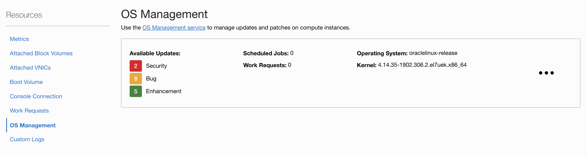
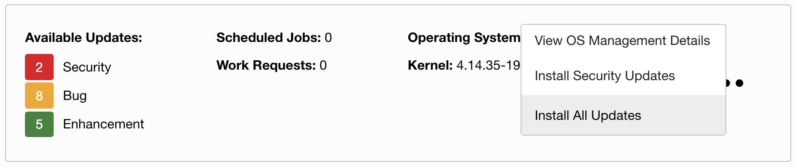
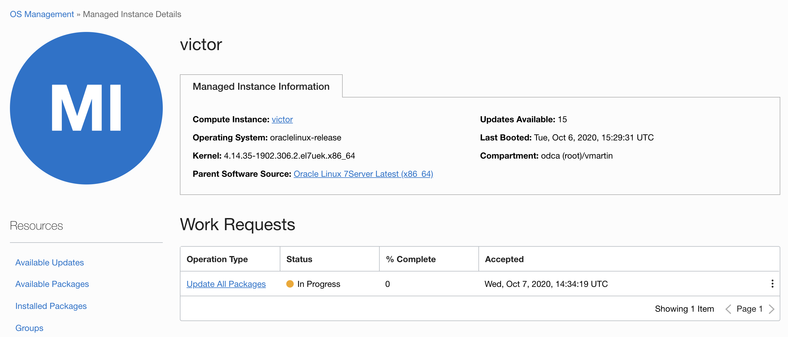

# OS Management

The Oracle Cloud Infrastructure [OS Management](https://docs.cloud.oracle.com/en-us/iaas/os-management/osms/index.htm) service allows you to manage updates and patches for the operating system environment on your Oracle Cloud Infrastructure instances.

## Start OSMS agent

Install package (Oracle Linux 8)

`sudo yum install -y osms-agent`

> It might be already installed

Check if it is running with...

`ps -elf | grep osms | grep -v grep`

and...

`sudo systemctl status oracle-cloud-agent`

## Create a Dynamic Group

Matching rule: `ALL {instance.compartment.id = '<ocid1.compartment.oc1...>' }`

## Write two policies

`Allow dynamic-group <dynamic-group-name> to use osms-managed-instances in compartment vmartin`

`Allow dynamic-group <dynamic-group-name> to read instance-family in compartment vmartin`

## Check Oracle Linux receive updates from OSMS

`sudo yum repolist`

`This system is receiving updates from OSMS server.`

Go to `Compute` > `Instances`. Select your instance in the list. Then scroll down and on the left menu select `OS Management`. You should see something like this:

You can click the three dots and `Update All Updates`

Confirm the updates:

And check the progress on the detail page:

You can cherry pick as well updates depending on your taste.
